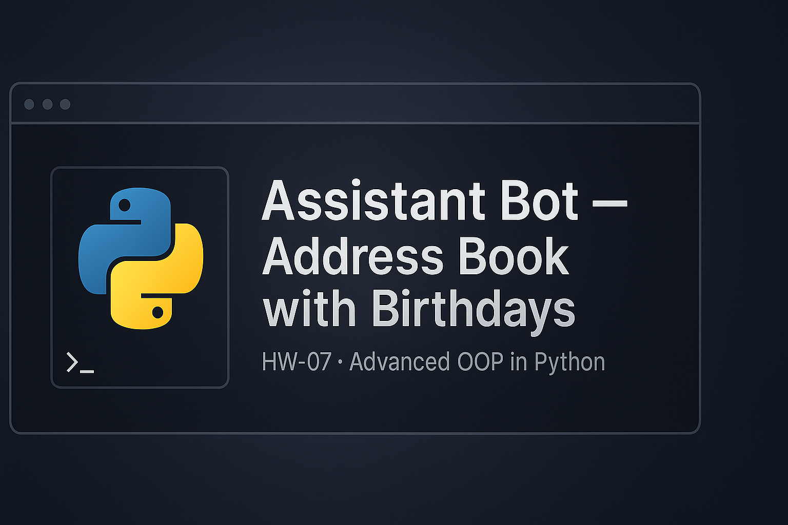

  

# 🧩 Assistant Bot — Address Book with Birthdays

**GOIT Python Core · HW-07 — Advanced Object-Oriented Programming**

---

## 📁 Структура проєкту

goit-pycore-hw-07/
│
├── .gitignore # Ігнорує кеш, середовище, IDE-файли
├── README.md # Документація проєкту (цей файл)
├── banner.png # Графічний банер (обкладинка репозиторію)
│
├── address_book.py # Класи: Field, Name, Phone, Birthday, Record, AddressBook
├── bot_commands.py # Логіка команд бота (add, change, phone, all, birthdays тощо)
└── main.py # Головний вхідний файл CLI-боку програми

🧠 Основна логіка

Програма — це CLI-бот, який керує адресною книгою контактів.
Кожен контакт може мати:

Ім’я (Name)

Один або кілька телефонів (Phone)

Необов’язкове поле дати народження (Birthday)

Користувач вводить команди — бот виконує дії, показує або змінює контакти.

💬 Підтримувані команди

| Команда                            | Опис                                               |
| ---------------------------------- | -------------------------------------------------- |
| `hello`                            | Привітання від бота                                |
| `add [ім'я] [телефон]`             | Додає новий контакт або новий телефон до існуючого |
| `change [ім'я] [старий] [новий]`   | Змінює телефон                                     |
| `phone [ім'я]`                     | Показує всі телефони контакту                      |
| `all`                              | Показує всі контакти в книзі                       |
| `add-birthday [ім'я] [DD.MM.YYYY]` | Додає дату народження                              |
| `show-birthday [ім'я]`             | Показує день народження контакту                   |
| `birthdays`                        | Показує, кого привітати протягом наступного тижня  |
| `close` або `exit`                 | Завершує роботу бота                               |

🧩 Приклад роботи

Welcome to the assistant bot!
Enter a command: hello
How can I help you?
Enter a command: add Mila 1234567890
Contact added.
Enter a command: add-birthday Mila 10.04.1995
Birthday added for Mila.
Enter a command: show-birthday Mila
Mila's birthday is 10.04.1995
Enter a command: all
Contact name: Mila, phones: 1234567890, birthday: 10.04.1995
Enter a command: exit
Good bye!

🧰 Використані класи

| Клас                         | Опис                                                      |
| ---------------------------- | --------------------------------------------------------- |
| **Field**                    | Базовий клас поля (value, **str**)                        |
| **Name**                     | Обов’язкове поле для імені                                |
| **Phone**                    | Поле з валідацією на **10 цифр**                          |
| **Birthday**                 | Поле з валідацією дати у форматі **DD.MM.YYYY**           |
| **Record**                   | Містить `Name`, список `Phone`, необов’язковий `Birthday` |
| **AddressBook**              | Колекція `Record`-ів (усі контакти)                       |
| **Декоратор `@input_error`** | Обробляє винятки й виводить зрозумілі повідомлення        |

🧪 Тестування через commands.txt

Можна створити файл commands.txt для автоматичного запуску:
Get-Content ".\commands.txt" | py ".\main.py"

Приклад вмісту:
hello
add John 1234567890
add-birthday John 15.06.1990
phone John
show-birthday John
birthdays
all
exit

📘 Примітки

Всі скрипти протестовано на Python 3.12

Використовується лише стандартна бібліотека (datetime, collections)

Зовнішніх залежностей немає — requirements.txt не потрібен

Код має типізацію, docstring-коментарі та відповідає PEP8

Розроблено для курсу GOIT Python Core

  GOIT Python Core — HW-07 · Assistant Bot Project 
  © 2025 All rights reserved

